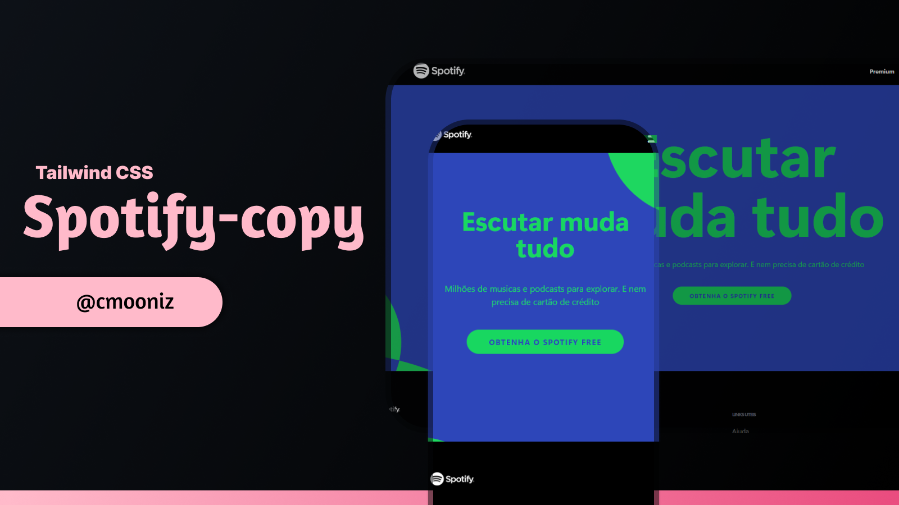

<h1 align="center"></h1>

 

This project is a replica of the Spotify website built entirely using Tailwind CSS, a utility-first CSS framework.  
Through this project, I aimed to enhance my proficiency in frontend development and deepen my understanding of Tailwind CSS's capabilities.  
The clone closely mimics Spotify's user interface, including its layout and styling.
 
 
 

